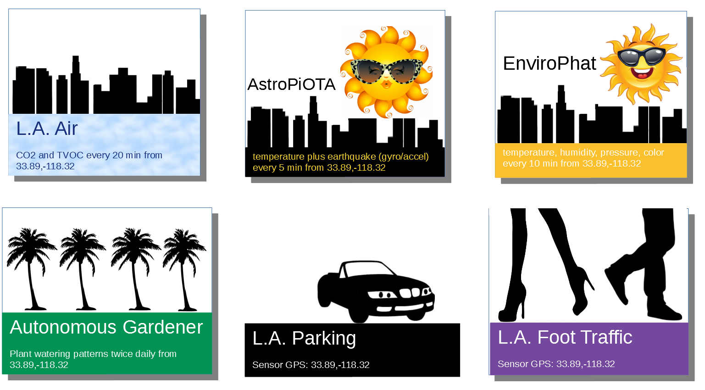

<!DOCTYPE html>
<html>
<body>
<h1 align=center>I3 and IOTA</h1>
  
**This workshop includes step-by-step instructions for buying and selling data on the I3 Marketplace**  

Researchers at USC and IOTA teamed up to conduct experiments building IoT Devices and connecting them to the I3 Marketplace so they could buy and sell sensor data.  They stored data in the IOTA Tangle.  The results were demonstrated at the <a href="pubs/I3-Onramp.pdf">Aug-2019 I3 Intelligent-Integrated IoT Conference and Workshop hosted by USC</a>

In this workshop, you can learn to build your own IoT Device, connect it to I3 Marketplace, and store data in the Tangle.

<h3>Step 1:  Building your IoT device</h3>

Click on the IoT Device that you want to build.  AstroPiOTA and EnviroPhat are easy to build because you snap together two components.  CO2-TVOC requires connecting a few wires.  Autonomous Gardener has multiple components with a more complex wiring scheme.  LA parking and foot traffic will be available soon.  They require a camera.

<map name="sensormap">
  <area shape="rect" coords="0,0,300,225" href="https://github.com/NelsonPython/CO2TVOC" alt="CO2">
  <area shape="rect" coords="300,0,600,225" href="https://github.com/NelsonPython/AstroPiOTA" alt="AstroPiOTA">
  <area shape="rect" coords="600,0,900,225" href="https://github.com/NelsonPython/EnviroPhat" alt="EnviroPhat">

  <area shape="rect" coords="0,225,300,450" href="" alt="Coming Soon with new soil moisture sensor">
  <area shape="rect" coords="300,225,600,450" href="" alt="Parker" title="Coming Soon">
  <area shape="rect" coords="600,225,900,450," href="" alt="FootTraffic" title="Coming Soon">
</map>

<h3>Step 2:  <a href="https://github.com/NelsonPython/Connect_IoT_Device_to_I3">Connecting your IoT device to the I3 Marketplace</a>	</h3>

<h3>Step 3: Storing and evaluating your data</h3>

This is a sample chart showing data collected by four IoT devices over a 24 hour period

Here are links to view data on the Tangle

<a  class="w3-btn" href="https://devnet.thetangle.org/address/ZNJWDJBGQVLCNJIRXPDUKHESBYXGFADCKAUCXFZFCWEOUJOJIDZHDCMVQQTEMZIMPOXFCTM9QSNNUZVBX">AutoGardener</a>

<a  class="w3-btn" href="https://devnet.thetangle.org/address/VFMEYGUNJVBMRFORVRIOHVET9L9A9AJFCETCOEVI9WPJPRWWALLOBFLXQGGHTZWQKTBJELJNVA9SILXVZTMPMXKPWC">AstroPiOTA</a>

<a  class="w3-btn" href="https://devnet.thetangle.org/address/K9LYCBRIBMKPDPMDPTJSQTCXYVPBULSIRQZJEHINYQXBYNFCFSWUXIMXELKTGXCZLYDZNDJEVKSOBWDXXTTNMMPRPC">CO2-TVOC</a>

<a  class="w3-btn" href="https://devnet.thetangle.org/address/ORTP9BWTENDHERKNXRHRN9CAYPWSUXDPUZGFJVV9APCWORUFSE9N9OQYBSJEQAIBHJSWBIGFNQUDT9IUWBBPUYLAHB">EnviroPhat</a>

</body>
</html>
