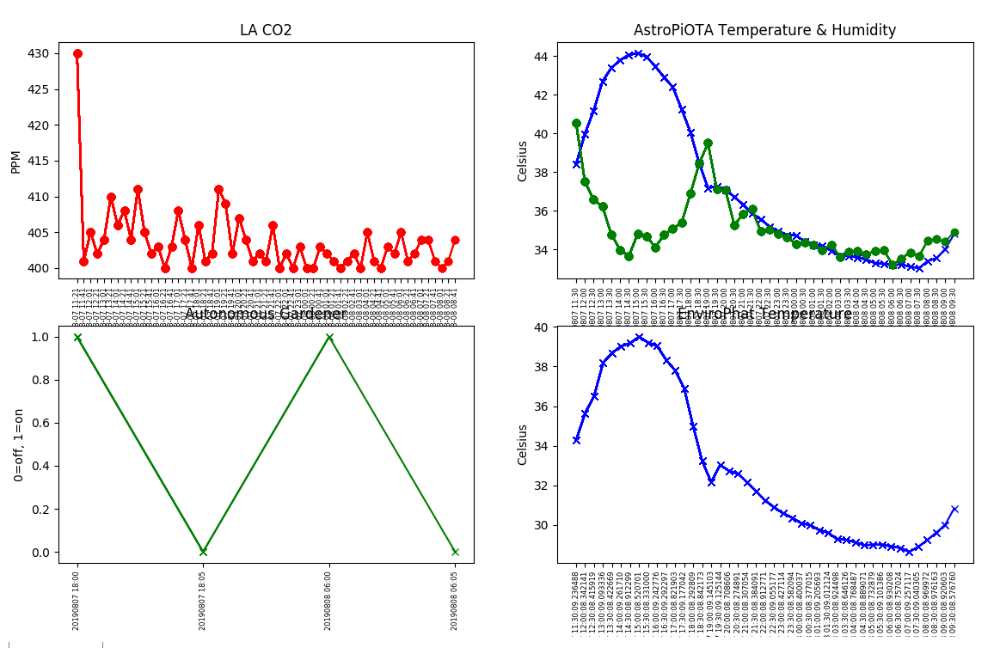

<!DOCTYPE html>
<html>
<body>
<h1 align=center>I3 and IOTA</h1>
  
**This workshop includes step-by-step instructions for buying and selling data on the I3 Marketplace**  

Researchers at USC and IOTA teamed up to conduct experiments building IoT Devices and connecting them to the I3 Marketplace so they could buy and sell sensor data.  They stored data in the IOTA Tangle.  The results were demonstrated at the <a href="pubs/I3-Onramp.pdf">Aug-2019 I3 Intelligent-Integrated IoT Conference and Workshop hosted by USC</a>

In this workshop, you learn to build your own IoT Device, connect it to I3 Marketplace, and store data in the Tangle.  You can follow these step-by-step tutorials or you may attend this workshop in person by joining this [MeetUp](https://www.eventbrite.com/e/intro-to-iot-i3-and-iota-tickets-71737176827).  If you want to facilitate this workshop, here is the [facilitator's guide](FacilitatorsGuide.md).

<h3>Step 1:  Building your IoT device</h3>

[AstroPiOTA](https://github.com/NelsonPython/AstroPiOTA) and [EnviroPhat](https://github.com/NelsonPython/EnviroPhat) are easy to build because you snap together two components.  [CO2-TVOC](https://github.com/NelsonPython/CO2TVOC) requires connecting a few wires.  [Autonomous Gardener](https://github.com/NelsonPython/AutoGardener) has multiple components with a more complex wiring scheme. 

<h3>Step 2:  <a href="https://github.com/NelsonPython/Connect_IoT_Device_to_I3">Connecting your IoT device to the I3 Marketplace</a>	</h3>

<h3>Step 3: Storing and evaluating your data</h3>

### Tangle data

<a  class="w3-btn" href="https://devnet.thetangle.org/address/VFMEYGUNJVBMRFORVRIOHVET9L9A9AJFCETCOEVI9WPJPRWWALLOBFLXQGGHTZWQKTBJELJNVA9SILXVZTMPMXKPWC">AstroPiOTA</a>

<a  class="w3-btn" href="https://devnet.thetangle.org/address/ZNJWDJBGQVLCNJIRXPDUKHESBYXGFADCKAUCXFZFCWEOUJOJIDZHDCMVQQTEMZIMPOXFCTM9QSNNUZVBX">AutoGardener</a>

<a  class="w3-btn" href="https://devnet.thetangle.org/address/K9LYCBRIBMKPDPMDPTJSQTCXYVPBULSIRQZJEHINYQXBYNFCFSWUXIMXELKTGXCZLYDZNDJEVKSOBWDXXTTNMMPRPC">CO2-TVOC</a>

<a  class="w3-btn" href="https://devnet.thetangle.org/address/ORTP9BWTENDHERKNXRHRN9CAYPWSUXDPUZGFJVV9APCWORUFSE9N9OQYBSJEQAIBHJSWBIGFNQUDT9IUWBBPUYLAHB">EnviroPhat</a>

Here is a sample chart showing data collected by four IoT devices over a 24 hour period

### ThingSpeak channels

[AstroPiota data visualization](https://thingspeak.com/channels/865101)

[EnviroPhat data visualization](https://thingspeak.com/channels/865246)

[CO2 data visualization](https://thingspeak.com/channels/865249)

</body>
</html>
